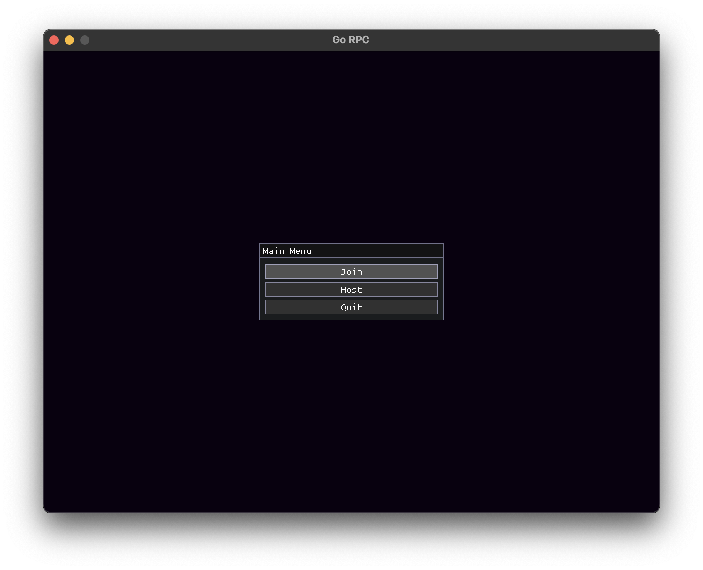
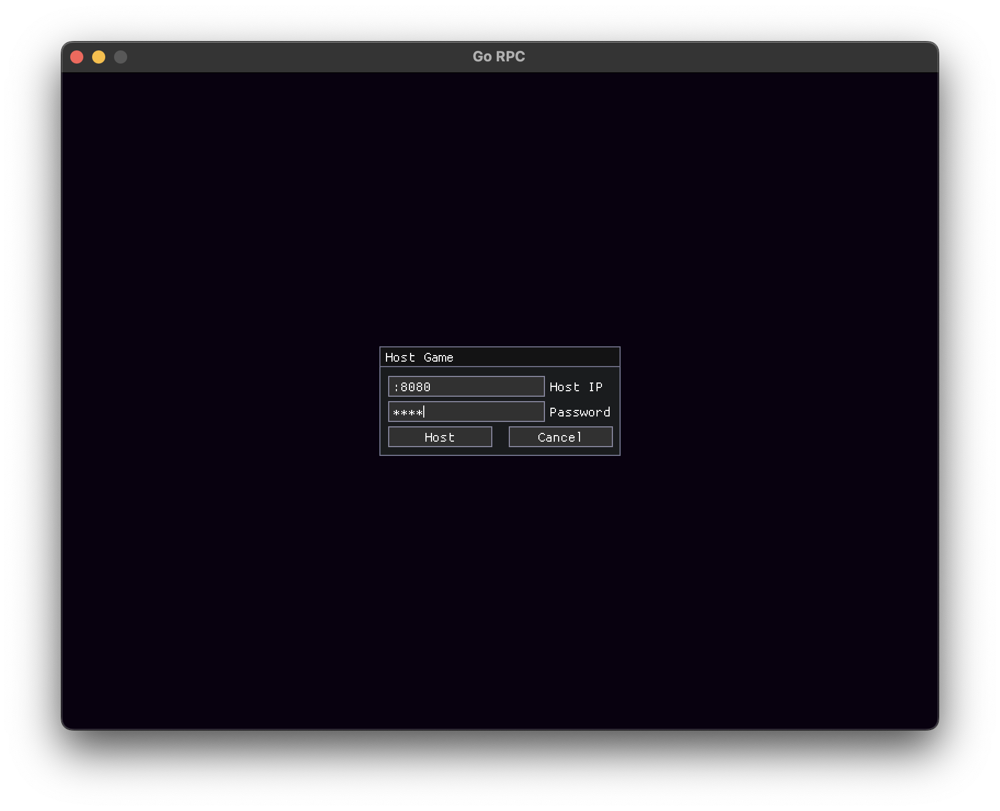
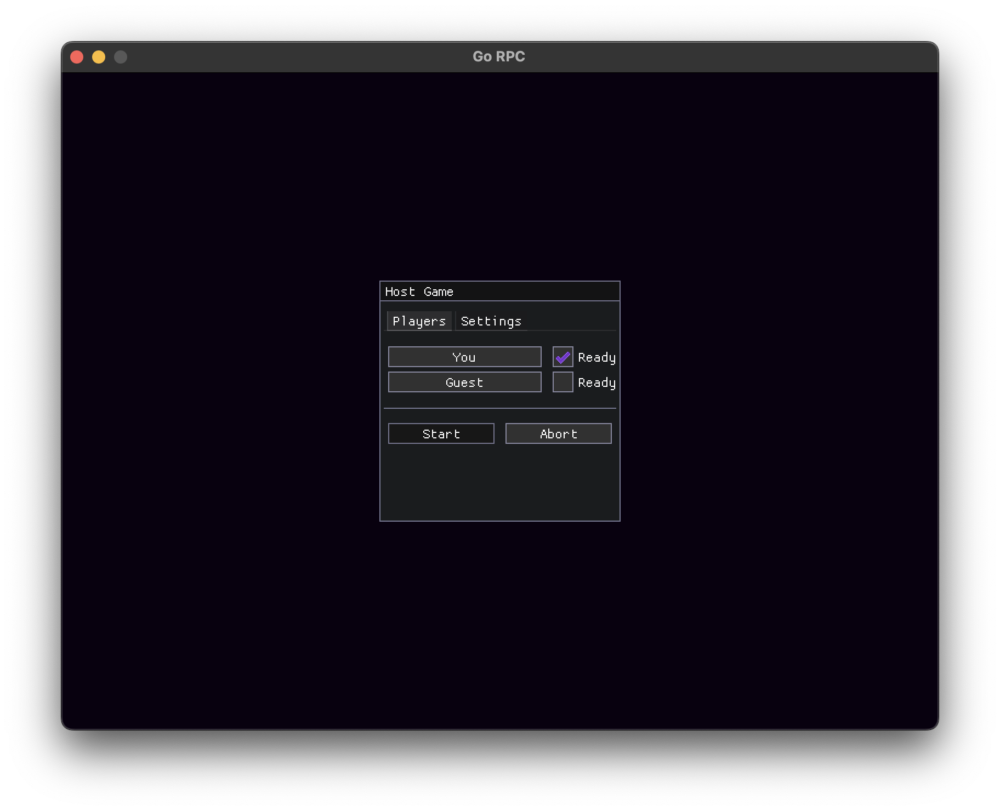
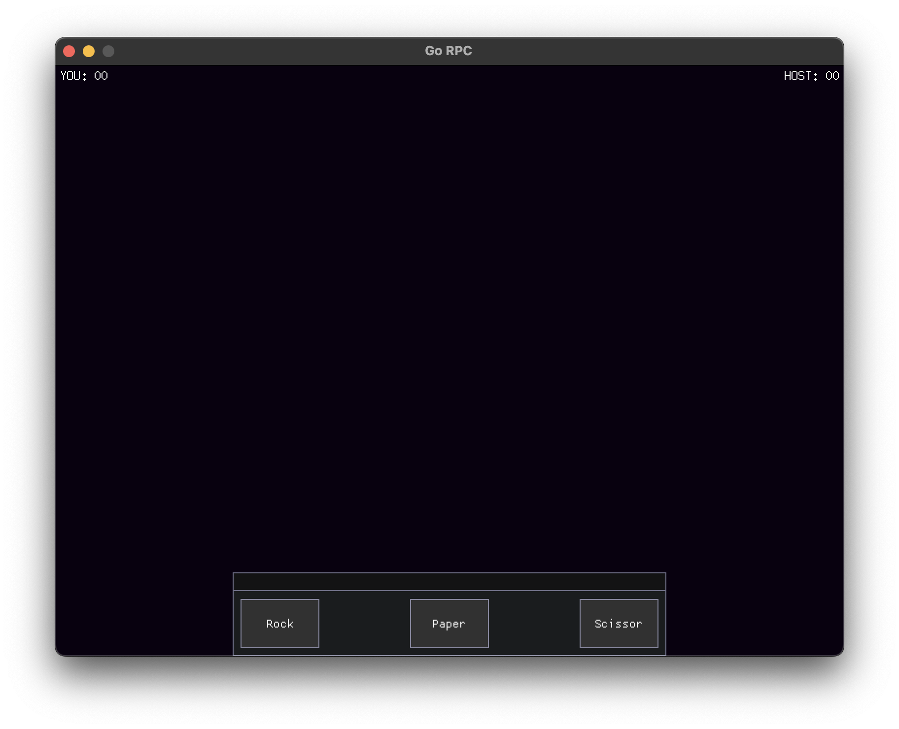

# Rock Paper Scissor in GO

Classic "Rock Paper Scissor" game made in Golang using SDL2 and
Golang networking module for networking. 

> Version 0.16

## Changelog

- Game scene foundation

## Usage

Placeholder text.
